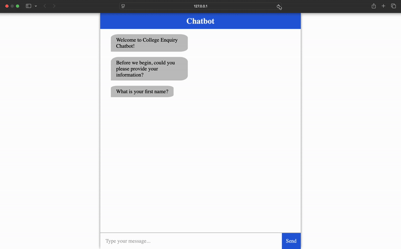

# College Enquiry Chatbot

An interactive cloud-based chatbot deployed on Google Compute Engine that provides information about the University of Cincinnati. The chatbot welcomes users, collects basic user information, and then allows them to ask a set list of questions about the college.

---

## Table of Contents

- [Overview](#overview)
- [Features](#features)
- [Tech Stack](#tech-stack)
- [Installation & Setup](#installation--setup)
- [Usage](#usage)
- [Screenshots / Demo](#screenshots--demo)

---

## Overview

The College Enquiry Chatbot is designed to provide quick answers to common questions about the University of Cincinnati. It collects a user's first name, last name, and email before presenting a set of predetermined questions such as:

- Does the college have a football team?
- Does it have a computer science major?
- What is the in-state tuition?
- Does it have on-campus housing?

---

## Features

- **Interactive Chat Interface:** Offers a conversational experience using a simple, clean chat UI.
- **User Information Collection:** Greets users and collects basic info (first name, last name, email) to personalize the interaction.
- **Predefined Q&A:** Provides instant answers to a fixed set of questions about the University of Cincinnati.
- **Cloud Deployment:** Hosted on GCP for scalable and reliable access.

---

## Tech Stack

- **Backend:** Python, Flask
- **Hosting:** Google Cloud Platform (GCP)
- **Frontend:** HTML, CSS, JavaScript
- **Key Libraries:** Flask

---


## Installation & Setup

### Local Setup

1. **Clone the Repository:**
  ```bash
  git clone https://github.com/yourusername/college-chatbot.git
  cd college-chatbot
  ```

2. **Create a Virtual Environment:**
  ```bash
  python -m venv venv
  source venv/bin/activate  # On Windows: venv\Scripts\activate
  ```

3. **Install Dependencies**
  ```bash
  pip install -r requirements.txt
  ```

4. **Run the Application Locally:**
  ```bash
  python main.py
  ```
   Then open your browser and navigate to http://127.0.0.1:8080 to interact with the chatbot.

### Deployed Version

- The chatbot is also deployed on GCP. Check out the live version [here](https://college-inquiry-chatbot-415701.ue.r.appspot.com/).

---

## Usage

- **Home Page:**  
  When you visit the homepage, you’re greeted with a chat interface that displays initial welcome messages.

- **User Information Collection:**  
  The chatbot first asks for your first name, last name, and email to personalize the conversation.

- **Interacting with the Chatbot:**  
  Once you provide your information, the chatbot presents you with a list of questions you can ask about the University of Cincinnati:
  - "Does the college have a football team?"
  - "Does it have a computer science major?"
  - "What is the in-state tuition?"
  - "Does it have on-campus housing?"
  
  Type one of these questions to get an answer. When you type "END", the chatbot will provide a summary of your interaction.

---

## Screenshots / Demo

Below is a demo GIF showcasing the chatbot in action:



*Replace `assets/college-chatbot-demo.gif` with the actual path or URL to your demo GIF.*
